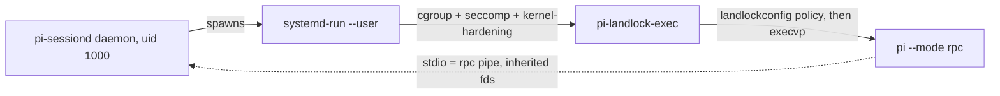

# Design: Landlock-based pi runtime sandbox

**Status:** accepted design.

**Goal:** the entire pi runtime — model loop, every tool, `bash`, the file
tools, any extension — runs confined; the trusted supervisor (`pi-sessiond`)
runs no model-steerable code. This document specifies *how* the confinement is
built for the per-session pi runtime: a **Landlock** access-control domain
(LSM), described by a declarative [landlockconfig](https://github.com/landlock-lsm/landlockconfig)
policy and applied unprivileged by a thin launcher between `systemd-run --user`
and `pi`. It is the runtime-isolation refactor's confinement mechanism
([pi-runtime-isolation-refactor.md](./pi-runtime-isolation-refactor.md)); the
supervisor/RPC-pipe inversion it assumes is unchanged.

The same policy format is the **permission manifest** third-party integration
authors write (§7), so one mechanism covers both the agent's own sandbox and
the per-integration sandboxes of
[agent-integrations-design.md](./agent-integrations-design.md).

---

## 1. Why Landlock, not a delegated user namespace

The obvious confinement for a `--user` service is a delegated user namespace
(`PrivateUsers=managed` → a distinct host uid from `systemd-nsresourced`). For
the per-session pi runtime it is the wrong tool, for structural reasons:

- **No writable persistent storage under a `--user` `managed` unit.** Every
  host-owned path — `BindPaths=` *or* the unit's own `StateDirectory=` — maps to
  `nobody:nobody` inside the delegated userns and is read-only. systemd makes a
  dir writable only by *idmapping* it, and that idmap is **system-scope only**
  (exec-invoke.c hard-skips user scope; a non-root user service "may not switch
  user identity"). `BindPaths=…:idmap` exists **only in systemd-nspawn, never in
  service units** (upstream issue #34695).
- **The supervisor-reads-the-jsonl requirement fights distinct-uid.** A
  privileged manager (PID 1) can idmap, but then it — not the uid-1000 daemon —
  owns the namespace, so the daemon cannot read the session dirs back. The only
  internally-consistent "supervisor owns the ns **and** reads the dirs" shape is
  user scope, the exact scope that cannot idmap.

Landlock is access control on the *real files at the real uid* — no uid mapping
— so all of the above dissolves:

- **Writability is a non-issue:** the runtime stays uid 1000 and owns its dirs.
  No `nobody`, no idmap, no `nsresourced`, no systemd rebuild.
- The security goal becomes a direct **allowlist**: the runtime may read/write
  its workspace/session/agent dirs, read `/nix/store`, reach the proxy port,
  talk to the granted skill sockets — nothing else. A more precise statement of
  the threat than "a different uid."
- It is **unprivileged, self-applied, inherited across fork+exec, and can only
  tighten** — `bash` and every child tool stay confined, and a self-loaded
  extension cannot loosen the domain.
- It applies **identically in user and system scope** — one mechanism for both
  the desktop (local) and system/remote executors.

The price: Landlock is **not** kernel-credential isolation. The runtime is
still uid 1000, so Landlock is paired with seccomp (§5.4), not a replacement for
it. §10 quantifies the residual risk and the optional nspawn backstop for the
multi-tenant executor.

---

## 2. Threat model

The control contains **arbitrary code executing as the sandbox principal,
steered by prompt injection** (malicious web/file/tool content). The model runs
`bash`, file tools, and self-loaded extensions, so the baseline assumption is
attacker-chosen unprivileged code.

| in scope (must contain) | out of scope |
|---|---|
| read/exfil of the user's files & secrets outside the workspace | kernel LPE / 0-day (→ needs a VM, not Landlock or nspawn) |
| reaching/owning integration namespaces & sockets not granted | misuse of *granted* capability (→ the approval gateway) |
| tampering with the user's other processes (ptrace/signal) | exfil over the one allowed proxy channel |
| cross-session reach (session A → session B) | the trusted supervisor / gateway itself |

The supervisor, the approval gateway, and secrets that never enter the sandbox
(the OpenRouter key — injected by the credential proxy) remain trusted and
outside the sandbox.

---

## 3. What Landlock provides

Self-applied via three syscalls (`landlock_create_ruleset`,
`landlock_add_rule`, `landlock_restrict_self`); requires `no_new_privs` (the
unit sets it); additive (a domain can only be narrowed by descendants).

| ABI | kernel | capability |
|---|---|---|
| 1–3 | 5.13–6.2 | path access: read / write / execute / create / delete / readdir / truncate, per-leaf |
| 4 | 6.7 | **TCP bind/connect port** allowlist |
| 5 | 6.10 | `ioctl` on device files (`ioctl_dev`) — not needed here |
| 6 | 6.12 | **scoping**: deny signals + abstract-unix-socket connects to processes *outside* the domain |

We need **ABI 4** (lock egress to the credential-proxy port, §5.2) and **ABI 6**
(cross-session/other-process scoping, §5.3 — the load-bearing replacement for
distinct-uid isolation). `amy` runs kernel **6.18** and the CI VM kernel is
6.18.x → full ABI 6. The launcher requests the highest ABI and degrades
**best-effort** (§6): on a hypothetical older kernel the network/scoping rules
silently drop to a weaker-but-functional FS-only domain, logged at startup.

**What Landlock does not cover** (→ seccomp's job, §5.4): `ptrace`/
`process_vm_*`, kernel keyrings (`keyctl`), SysV/POSIX shared memory & message
queues, `bpf`, `io_uring`, `userfaultfd`, raw syscall surface. Also: a path you
must *traverse* (`x` on a parent) stays stat-able — keep rules leaf-scoped
(§5.1).

---

## 4. Architecture

Three thin layers, each doing the one thing it is good at; **no user namespace**
anywhere:



- **`systemd-run --user`** provides: the per-session cgroup scope (idle-GC +
  `MemoryHigh`), `SystemCallFilter=` (seccomp, §5.4), `NoNewPrivileges=true`,
  `ProtectKernelTunables/Modules/Logs`, `ProtectControlGroups`, `ProtectClock`,
  `ProtectProc=invisible`, `RestrictSUIDSGID`, `LockPersonality`,
  `RestrictAddressFamilies`, `RestrictNamespaces`. All proven compatible with a
  `--user` unit.
- **`pi-landlock-exec`** (§6) reads a landlockconfig policy, calls
  `landlock_restrict_self()`, then `execvp("pi", …)`. The domain is inherited by
  `pi` and every tool/`bash`/extension it spawns.
- **`pi`** runs as uid 1000, owns its dirs (no idmap), and talks to the
  supervisor over the inherited rpc pipe (`--pipe --wait` stdio) — no FS/socket
  needed for the control channel.

The per-session unit carries none of the userns machinery: no
`PrivateUsers=managed`, no `nsresourced`/idmap, no `PrivateDevices`/`PrivateTmp`,
and no `ProtectHome=tmpfs` + same-path `BindPaths` — Landlock denies non-granted
paths directly, so nothing is hidden then bound back. The supervisor daemon is a
separate unit with its own hardening (§8).

---

## 5. The policy (a landlockconfig manifest)

The per-session policy is a [landlockconfig](https://github.com/landlock-lsm/landlockconfig)
document — the reference declarative format for Landlock, JSON or TOML with
identical semantics, maintained by the Landlock kernel maintainers and kept in
sync with kernel ABI. It is **deny-by-default**: only what a rule grants is
reachable. The supervisor emits one document per session; the launcher applies
it (§6).

Paths are the ones the runtime uses today (`main.ts`): `STATE_DIR =
%S/pi-sessiond-local` (`~/.local/state/pi-sessiond-local`), `sessions/<id>`
(holding this session's private `agent/` = the child's `HOME` /
`PI_CODING_AGENT_DIR`), `workspaces/<id>`. The daemon keeps its own
`$STATE_DIR/pi-agent` for in-process model discovery; children never use it.

### 5.1 Filesystem allowlist (`pathBeneath`)

| access | path | why |
|---|---|---|
| **rw** (dir) | `workspaces/<id>` | pi's cwd / scratch |
| **rw** (dir) | `sessions/<id>` | committed `session.jsonl`, the policy, the session's private `agent/` (its `HOME`/`PI_CODING_AGENT_DIR`) and `tmp/` (`TMPDIR`) — both nest under this one grant |
| **rw** (dir) | `$SEDIMENT_DB` dir (`%h/<memoryDbRel>`) | long-term memory store — the **one** writable dir shared across sessions (when `memory.enable`) |
| **ro+x** (dir) | `/nix/store` | the runtime image, `pi`, node, skill CLIs, `HF_HOME` model cache |
| **ro** (dir) | `/etc/ssl`, `/etc/static/ssl` | TLS CA dirs (read + list) |
| **ro** (file) | `/etc/resolv.conf`, `/etc/passwd`, `/etc/group`, `/etc/nsswitch.conf` | DNS / name resolution |
| **rw** (file) | `/dev/null`, `/dev/zero`, `/dev/urandom`, `/dev/random`, `/dev/tty` | device essentials |
| **rw**/**ro** | granted skill paths — `SKILL_CONFIG_SOCKET`, the Signal `enqueue.sock`, the open-url socket (files); the skill-config store, `skills-defs`, notifications (dirs) | the in-sandbox tools reach skills/integrations through these, published per-skill via `services.pi-chat.sandboxAllowedPaths` |

Each grant takes exactly the access class its inode supports: a **directory**
gets the directory rights (`read_dir`, plus `read_write`'s create/remove for
`rw`); a **file**, socket, or device node gets only the file rights
(`read_file`/`write_file`). This split is load-bearing — a directory right on a
file, or a file-only grant on a directory the runtime must list, is inert and
downgrades the ruleset to *partially enforced*, which must mean "the kernel
lacks an ABI", never "a rule was mis-shaped". A skill grant ending in `.sock` is
treated as a file; any other skill path as a directory.

Everything else — the rest of `$HOME`, other users, other `/run/user` sockets,
other sessions' `workspaces/`/`sessions/` — is **denied** by absence from the
allowlist. Rules are **leaf-scoped** (grant `sessions/<id>`, not `$STATE_DIR`) so
siblings stay both unreadable and unlistable.

Skill sockets are named directly in the allowlist — there is no `/run/user`
tmpfs hiding them — so a tool's reach to a skill or integration is exactly the
set the allowlist grants, and nothing more.

### 5.2 Network (`netPort`, ABI 4)

Allow **TCP connect to the model endpoint port(s) only**: the credential-proxy
port (`OPENROUTER_PROXY_URL` = `127.0.0.1:<port>`) when the openrouter provider
is enabled, and/or the loopback **llama-swap** port (`LLAMA_SWAP_BASE_URL`) for
the local provider. Deny `bind` (the runtime never listens). In openrouter mode
the model holds **no API key** (the proxy injects it upstream); in local mode
the endpoint is loopback. Either way these are the only useful egress targets.

*Limitation:* Landlock network is **port-granular, not address-granular** — a
connect-allow on the proxy port also permits that port on any address. Minor
here: the model holds no credentials, bulk exfil over the proxy is already out
of scope (§2), and the proxy itself decides the upstream host.
`RestrictAddressFamilies=AF_UNIX AF_INET` on the unit narrows families further.

### 5.3 IPC scoping (`scoped`, ABI 6)

A ruleset with `scoped: ["signal", "abstract_unix_socket"]`: the runtime cannot
signal, nor connect to abstract-unix sockets created by, processes **outside its
own domain**. This walls off the user's other processes and other sessions
(Wayland/X/D-Bus abstract sockets, other sessions' pids) **at the same uid** —
the cross-session/integration isolation otherwise gained from a distinct uid,
achieved without one. ABI 6 is what makes "Landlock instead of a delegated
userns" actually deliver §8.

### 5.4 seccomp companion (on the `systemd-run` unit)

Landlock leaves same-uid kernel objects exposed; seccomp closes them. No
Landlock policy format covers syscalls, so this stays on the unit, where
`systemd-run` already provides it for free:

`SystemCallFilter=@system-service` baseline, then **deny**: `ptrace`,
`process_vm_readv`, `process_vm_writev`, `keyctl`, `request_key`, `add_key`,
`shmget`, `shmat`, `shmdt`, `shmctl`, `mq_*`, `bpf`, `io_uring_setup`,
`userfaultfd`, `perf_event_open`, `kcmp`.

Denying the `ptrace` syscall outright fully closes same-uid `ptrace` from the
sandbox — the runtime cannot trace any process, so no `kernel.yama.ptrace_scope`
sysctl is needed on top. The denylist is load-bearing (§11 names same-uid
`ptrace` as the sharpest edge), so it is encoded in one place — the unit builder
(§8) — and tested.

Blocked calls return **`EPERM`** (`SystemCallErrorNumber=EPERM`), not the systemd
default of SIGSYS-killing the process. This is required, not cosmetic: node's
libuv probes `io_uring_setup` at startup and falls back to its epoll backend on
`EPERM`, whereas a SIGSYS would core-dump the whole `pi` runtime before the first
turn. The denylist still bars every listed call — only the failure mode changes
from fatal to a clean errno.

### 5.5 Worked example

The supervisor emits, per session, a document of this shape — literal paths, one
`pathBeneath` entry per access-class bucket (empty buckets dropped):

```json
{
  "abi": 6,
  "ruleset": [{ "scoped": ["signal", "abstract_unix_socket"] }],
  "pathBeneath": [
    { "allowedAccess": ["abi.read_write"], "parent": [
        "/home/amy/.local/state/pi-sessiond-local/workspaces/<id>",
        "/home/amy/.local/state/pi-sessiond-local/sessions/<id>" ] },
    { "allowedAccess": ["read_file", "write_file"], "parent": [
        "/dev/null", "/dev/zero", "/dev/urandom", "/dev/random", "/dev/tty" ] },
    { "allowedAccess": ["abi.read_execute"], "parent": ["/nix/store"] },
    { "allowedAccess": ["read_file", "read_dir"], "parent": [
        "/etc/ssl", "/etc/static/ssl" ] },
    { "allowedAccess": ["read_file"], "parent": [
        "/etc/resolv.conf", "/etc/passwd", "/etc/group", "/etc/nsswitch.conf" ] }
  ],
  "netPort": [
    { "allowedAccess": ["connect_tcp"], "port": [<proxyPort>, <llamaSwapPort>] }
  ]
}
```

Skill grants (§5.1) fold into these same buckets by mode and inode: a `.sock`
into the `read_file`/`write_file` entry, a directory into the matching `read_dir`
group.

`abi: 6` plus landlockconfig's best-effort compatibility modes mean an older
kernel keeps the FS allowlist and drops `netPort`/`scoped` rather than failing.

---

## 6. The launcher

systemd has **no Landlock directive** in our pinned systemd (only the
`landlock_*` syscalls are whitelisted in the `@sandbox` seccomp set;
`LandlockConfig=`, PR #39174, is proposed and unmerged). So the policy is
applied by a thin launcher.

**`pi-landlock-exec` is the landlockconfig reference sandboxer**, packaged in the
flake. landlockconfig ships a `sandboxer` example (Rust and C) that already does
exactly the job: parse one-or-more JSON/TOML policies, build the ruleset with
**best-effort** ABI degradation, `restrict_self()`, then `exec` the command
after `--`. We adopt it directly (or as a ~30-line wrapper around the
`landlockconfig` crate):

```
pi-landlock-exec --json <policy.json> -- pi --mode rpc --session-dir <dir> --session-id <id> ...
```

Why this shape:

- **No bespoke policy DSL or argv contract to own.** The grant model, the ABI
  groups, the best-effort behavior, and the JSON/TOML schema are upstream,
  maintained by the kernel team, and forward-compatible by construction
  (declare handled access rights; older kernels ignore unknown ones).
- **Composable.** Multiple `--json`/`--toml` flags layer policies (base +
  per-session), Landlock intersecting them — useful for a shared base profile
  plus a session-specific overlay.
- **A clean exit path.** If systemd's `LandlockConfig=` lands, the launcher
  disappears: the unit carries the same landlockconfig file natively.
  landlockconfig is explicitly positioned as the interchange format for such
  service-manager/container-runtime consumers, so the policy we write today
  survives the launcher.

The supervisor↔launcher boundary: `landlock_restrict_self()` must run in the
final pre-`exec` process, which the Bun daemon cannot do for the node `pi` child
it spawns. So the launcher stays a native Rust binary (packaged via
`rustPlatform.buildRustPackage`); `sandbox.ts` only *emits* the policy JSON and
the `systemd-run` argv (pure, unit-tested, §8).

---

## 7. The manifest, shared with integrations

The landlockconfig document is the **permission manifest**. The requirement —
deny-by-default with permissions added via a reviewed allowlist, and a format
third-party authors can write to *request* access — is met by landlockconfig
directly: it is declarative, deny-by-default, and human-writable (TOML) or
machine-generated (JSON).

One format serves both sandboxes in this stack:

- **pi runtime sandbox** (this document): the supervisor generates the policy
  per session from known paths (§5). No human writes it.
- **per-integration sandboxes** ([agent-integrations §5.4](./agent-integrations-design.md)):
  an integration's high-level manifest declares its filesystem paths, network,
  and IPC posture; the trusted materialiser **lowers** that to a landlockconfig
  policy enforced by the same launcher. Third-party authors request permissions
  in the high-level manifest; the user reviews and approves it on enable (the
  manifest display is the trust barrier); landlockconfig is the enforcement
  target, not what the author hand-writes.

So "support a manifest for permissions" is satisfied with **one** policy format
across the agent and every integration, rather than a bespoke per-surface
scheme.

---

## 8. Code integration

- **`packages/pi-sessiond/sandbox.ts`** — a `systemd-run --user` argv builder
  **plus** a landlockconfig policy emitter. A `SandboxPolicy` (rw dirs —
  workspace + session dir, ro/rw paths, socket grants, model-endpoint port[s],
  scope flags) yields two pure, unit-tested outputs: the `systemd-run` argv
  (cgroup + seccomp denylist + kernel hardening) and the policy JSON. The
  per-session unit carries no `PrivateUsers`, `PrivateDevices`, `PrivateTmp`,
  `ProtectHome`, `TemporaryFileSystem`, or `BindPaths` — the allowlist is the
  whole confinement.
- **`packages/pi-sessiond/main.ts`** — the spawn call assembles the allowlist
  (workspace + session dir, the `ALLOWED_PATHS` skill sources, the memory store
  when enabled, the credential-proxy and/or llama-swap port), writes it to a
  per-session policy file, and invokes `systemd-run … pi-landlock-exec --json
  <policy> -- pi …`. The session's private agent dir (`HOME`) and `TMPDIR` nest
  under the session-dir grant; the rpc pipe and `cwd` need no grant of their own.
- **`modules/nixos/pi-sessiond-local.nix`** — the desktop user service. Skill
  paths arrive through `allowedPaths` and fold into each session's Landlock FS
  allowlist by mode; `pi-landlock-exec`'s absolute path is handed over via
  `SPACES_SESSIOND_LANDLOCK_EXEC`. The supervisor daemon is hardened with
  `ProtectHome=tmpfs` (so it — and any in-process extension — never sees `$HOME`)
  and binds back its state dir plus the user-manager IPC endpoints (`%t/systemd`,
  `%t/bus`) it needs to spawn each session via `systemd-run --user`.
- **`modules/nixos/pi-sessiond/default.nix`** — the system/remote service. The
  root supervisor spawns each session through the same launcher with
  `systemd-run --uid=pi-session`, chowns the session dirs to that uid, and sets
  `StateDirectoryMode=0711` so the uid can traverse to its chowned leaf (§14).
- **`packages/pi-landlock-exec/`** — the landlockconfig sandboxer, built in the
  flake against a pinned `landlockconfig` revision.

---

## 9. Per-session & cross-session isolation

Each session is a distinct `systemd-run --user` unit with its **own Landlock
domain** whose `pathBeneath` names only *that* session's `workspaces/<id>` and
`sessions/<id>` (the latter holding the session's private `agent/` = its `HOME`).
So session A's domain cannot open session B's workspace, agent dir, or transcript
(absent from A's allowlist), and the ABI-6 `scoped` ruleset blocks A from
signalling or abstract-socket-connecting to B's processes. The only writable dir
shared across sessions is the long-term memory store (`$SEDIMENT_DB`), by design.

Same-uid caveat: A and B are both uid 1000, so absent seccomp they could
`ptrace` each other — closed by §5.4, which denies the `ptrace` syscall outright.

---

## 10. Wrappers evaluated

The design reuses an upstream policy format and launcher rather than hand-rolling
a sandbox. The landscape splits by what each tool covers:

| tool | Landlock | seccomp | manifest | deny-default | ABI 4 net | ABI 6 scope | notes |
|---|---|---|---|---|---|---|---|
| **landlockconfig** | ✓ | ✗ | ✓ official JSON/TOML | ✓ | ✓ `netPort` | ✓ `scoped` | **chosen.** kernel-maintainer format + crate + C FFI + reference sandboxer |
| island | ✓ | ✗ | ✓ (uses landlockconfig) | ✓ | ✓ | ✓ | high-level wrapper; cwd/workspace activation model, WIP — wrong shape for per-session units |
| landrun | ✓ (v5) | ✗ | ✗ (flags only) | ✓ | ✓ | ✗ | Go; no scoping, no manifest |
| nono | ✓ | partial (seccomp-notify) | ✓ JSON + registry + `extends` | ✓ | ✓ | ✓ (isolation modes) | full agent-sandbox product; see below |
| extrasafe | ✓ **ABI 2 only** | ✓ | ✗ (code) | ✓ | ✗ | ✗ | only candidate doing seccomp+Landlock, but no net/scope; x86_64-only |
| birdcage / hakoniwa | via namespaces | ~ | ✗ | ✓ | ~ | ~ | namespace-based — the machinery this design deliberately drops |

**Why landlockconfig.** It maps 1:1 onto §5 (`pathBeneath` → FS, `netPort` →
ABI-4 ports, `ruleset.scoped` → ABI-6 signal + abstract-unix), is deny-by-default
and forward-compatible, ships a reference sandboxer so the launcher is near-zero
bespoke code, and is the same format systemd's proposed `LandlockConfig=` would
consume. seccomp is not its job — but seccomp is not *any* Landlock format's job,
and `systemd-run` already provides it (§5.4).

**On nono (build vs. buy).** nono is the closest turnkey product — an AI-agent
sandbox (Landlock + Seatbelt) with a credential-injection proxy mirroring our
OpenRouter proxy, host+path **L7** network filtering (stronger than our
port-granular §5.2), per-command approval policy resembling agent-integrations
§5.3, and a profile/registry manifest with `extends`. There is no hard technical
blocker to adopting it for the launcher + proxy slice, and its `credential_capture`
`cmd://` hook can bridge to our TPM2 `systemd-creds` store. It is **not chosen**
for one deliberate reason: the trusted boundary is the crown-jewel invariant the
whole integrations design rests on, and we keep it small and owned (a
landlockconfig policy + a ~30-line launcher + our supervisor) rather than ceding
it to a pre-1.0 external product with a large surface (registry, audit ledger,
proxies, rollback). nono cannot replace the supervisor anyway (WebSocket
transport, session lifecycle, RPC-pipe drive, MCP integration sockets, panel
side-channels) — it would slot in as launcher+proxy only, and that slice is
exactly what landlockconfig covers with a fraction of the dependency weight. Its
profile schema is recorded as prior art for the integration manifest's
permission block.

---

## 11. Residual risk: Landlock + seccomp vs. + nspawn

Both configurations run Landlock + seccomp + `NoNewPrivileges`. nspawn would add
distinct-uid + mount/pid/net/ipc namespaces on top.

**Shared by both (nspawn does not help):** kernel LPE (both share the host
kernel — only a VM contains this; userns/nspawn may even *add* LPE surface),
misuse of granted scope, exfil over the allowed proxy channel.

**What nspawn adds — a defense-in-depth backstop:**

| Landlock-only residual | severity | mitigable without nspawn? |
|---|---|---|
| **policy gap** (over-grant a path / forget a seccomp entry) → reachable as uid 1000 | high | only by getting allowlist + seccomp exactly right |
| **ptrace into the user's other processes** → session takeover | high | yes: seccomp-deny `ptrace`/`process_vm_*` |
| keyring (`keyctl`) read | medium | yes: seccomp-deny |
| SysV/POSIX shm & mqueue | low–med | yes: seccomp-deny |
| filesystem *structure* enumeration | low | mostly, with leaf-scoped rules |

The honest delta: **nspawn's value is forgiveness of policy mistakes** — a
distinct uid is a DAC backstop behind the allowlist/seccomp. Landlock-only's
security rests on getting *both* policies right; the single sharpest edge is
same-uid `ptrace`, fully closable but must-not-forget.

**Recommendation for `amy` (single-user desktop, model-steered-tool threat):**
ship **Landlock + a tight seccomp profile** as the primary control — on-target,
unprivileged, and free of the nsresourced/managed-userns machinery. Treat
**nspawn as optional belt-and-suspenders** (nspawn *does* support idmapped binds,
unlike service units — issue #34695) for the system/remote (multi-tenant)
executor, or if the uid backstop is later deemed worth the container machinery.
A kernel 0-day defeats both — that is a microVM, separately.

---

## 12. Verification

- **Cheap focused check** (`checks/pi-sessiond-landlock/`, a small `runNixOSTest`
  — Landlock needs a real kernel, so not a bare `runCommand`): run
  `pi-landlock-exec` with a known landlockconfig policy around a probe binary and
  assert, in one boot:
  - **can** write `workspaces/<id>`, read `/nix/store`;
  - **cannot** read a non-granted file (`/home/test/secret`) → `EACCES`;
  - **cannot** `connect()` a non-proxy TCP port;
  - **cannot** `kill()` an outside-domain pid (ABI 6);
  - effective ABI level logged (assert ≥ 4, ideally 6).
- **VM test** (`checks/test-machine.nix`, the local executor / `amy` path): a
  real chat round-trip works, and the "bash runs sandboxed: `HOME` hidden"
  subtest confirms a tool command cannot read the login `$HOME` — Landlock deny,
  with no `ProtectHome` on the session unit.
- **Unit** (`sandbox.test.ts`, run by `checks/pi-sessiond-sandbox/`): the emitted
  landlockconfig policy contains the expected grants/scope and excludes
  `$HOME`/sibling sessions; the `systemd-run` argv carries the seccomp denylist.
- **Signal skill** — the allowlist + forwarding contract is pinned by
  `checks/spaces-signal-nix-eval` (the signal-cli daemon socket is **never**
  granted, the message store is `ro`, the bridge's `sandbox/` dir holding
  `enqueue.sock` is `rw`); the send-approval round-trip is pinned by
  `checks/pi-session-signal-confirm` (a queued send blocks until approved on the
  panel, which the sandbox cannot reach).

---

## 13. POC plan

The path to a **usable POC** — the desktop (local) executor running a real chat
session confined by the landlockconfig domain, end to end in the VM. Scoped
deliberately: the `managed` path stays alongside (additive, A/B-able) so the
desktop never breaks mid-POC. Deleting `managed`/`nsresourced`, extending to the
system/remote executor, and the nspawn backstop (§11) are all **post-POC** (§14).

Risk-ordered: front-load the two real unknowns — *does the mechanism + Nix
packaging work* (Phase 0–1, isolated from pi-sessiond) and *does a real `pi` turn
survive the allowlist* (Phase 4, the §15 tuning risk) — and prove them cheaply
before and around the wiring.

**Phase 0 — launcher spike.** Add `packages/pi-landlock-exec/`: a small Rust bin
crate (deps `landlockconfig` + `landlock`; reference: landlockconfig's
`examples/sandboxer.rs`) that reads repeatable `--json <policy>`, builds the
ruleset best-effort, `restrict_self()`, then `execvp` the argv after `--`,
logging the effective ABI. Package with `rustPlatform.buildRustPackage` (vendored
`Cargo.lock`; no crane, no flake-input change — blueprint discovers
`packages/<name>/`). *Done when* `nix build .#pi-landlock-exec` greens and the
binary execs a passthrough command.

**Phase 1 — cheap kernel check.** Add `checks/pi-sessiond-landlock/` (the §12
cheap check) around the launcher + a probe binary. *Done when* it greens — this
proves confinement independently of pi-sessiond, so the thesis stands before any
supervisor change.

**Phase 2 — policy emitter (pure, unit-tested, additive).** Add `SandboxPolicy` +
`buildLandlockPolicy()` (emits the landlockconfig JSON) and a launcher-argv path
carrying the §5.4 seccomp denylist, *alongside* the existing `managed` builder.
Extend `sandbox.test.ts` (the §12 unit assertions). *Done when* the unit tests
green and the `managed` path is untouched.

**Phase 3 — wire main.ts + module.** `main.ts` writes the per-session policy file
and spawns through the launcher; `pi-sessiond-local.nix` turns `bashBinds` into
`allowedPaths` and puts `pi-landlock-exec` on PATH / `SPACES_SESSIOND_LANDLOCK_EXEC`.
`nsresourced` stays imported. *Done when* a session starts under the launcher in
the VM.

**Phase 4 — real turn (the usable bar).** Run the §12 VM test; tune the FS
allowlist empirically (expect `/proc/self`, `/sys/devices/system/cpu`, a few
`/etc` entries) until a turn completes; confirm the "bash sandboxed: `HOME`
hidden" subtest holds via Landlock deny and Signal e2e works through the granted
`enqueue.sock`. *Done when* a chat reply lands, Signal works, and an
out-of-allowlist secret is unreadable — the **usable POC**.

Critical path to "works at all" is Phase 0 → 1: a standalone Rust binary plus one
cheap check, with no pi-sessiond risk. Everything after is integration and
allowlist tuning.

---

## 14. Beyond the POC

Both executors are now Landlock-only — no `landlock.enable` toggle, no
managed-userns path anywhere. The `managed` builder, the `trusted`/`binds`
config, the `ProtectHome`/`TemporaryFileSystem` block, and `nsresourced.nix`
(with its BTF systemd-package override) are all **deleted**. What was done:

1. **Done — local executor cutover.** Every desktop pi child (a uid-1000 user
   service) is spawned through pi-landlock-exec.
2. **Done — system/remote executor cutover.** `services.pi-sessiond` (a root
   system service) spawns each session through the same launcher via
   `systemd-run --uid=pi-session`, dropping the unit to a dedicated non-root uid
   (Landlock does not drop privilege). The root daemon `chown`s each session's
   `workspaces/<id>` + `sessions/<id>` to that uid and reads the committed jsonl
   back as root; `StateDirectoryMode=0711` lets the uid traverse to its leaf. All
   sessions share the one `pi-session` uid — cross-session isolation is the same
   Landlock `scoped` + seccomp wall as the desktop, not a distinct-uid namespace.
   One mechanism, one policy emitter, one launcher for both executors.
   Pinned by `checks/pi-sessiond-session-uid`: the spawned `pi-session-<id>`
   service runs as the non-root `pi-session` uid (the supervisor stays root) and
   the session dirs are chowned to it.
3. **Optional, later — nspawn uid backstop.** If a genuinely *multi-user* server
   (distinct humans, not just distinct sessions), or the policy-mistake
   forgiveness of a per-session distinct uid (§11), is later judged worth the
   container machinery, wrap the unit in nspawn for idmapped binds + namespace
   isolation *on top of* Landlock+seccomp. Not needed for the single-user desktop
   or the current single-user server, and explicitly out of scope until then.

---

## 15. Open questions

- **Allowlist completeness for a real `pi` turn** — the node `pi` runtime touches
  paths beyond the table (`/proc/self`, `/sys/devices/system/cpu`, `/etc/...`);
  the set is tuned empirically. Over-granting erodes the benefit — keep a
  reviewed minimal set.
- **landlockconfig stability** — the schema is explicitly pre-1.0/unstable. Pin a
  revision; the kernel-maintainer backing and small surface keep the risk low,
  but track it.
- **Network granularity** — port-granular only (§5.2). Accept (the proxy bounds
  the upstream host), or add a loopback-only net namespace later (it would need
  its own mechanism, since the sandbox uses no userns).
