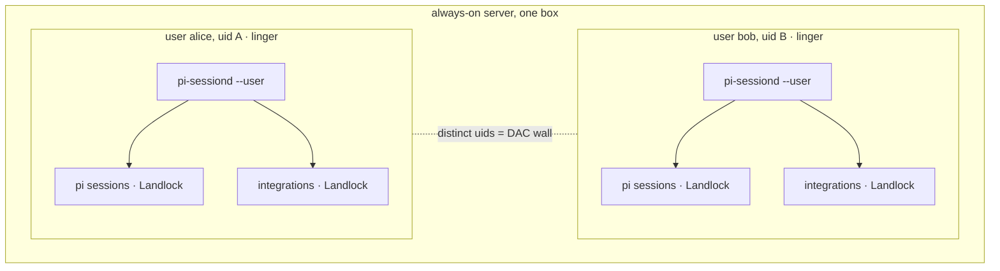

# Design: per-user `pi-sessiond` (retiring the root remote executor)

**Status:** accepted design; **implementation pending**. The server executor
today is the root system service `modules/nixos/pi-sessiond/default.nix`; this
document specifies its replacement by one `--user` `pi-sessiond` per remote
user. Until it lands, treat the per-user model as the target — the integration
design ([agent-integrations-design.md](./agent-integrations-design.md)) is
written against it as a prerequisite.

**Goal:** a multi-user server runs **one `pi-sessiond` per remote user, each as
that user's own uid**, structurally identical to the desktop's per-user
`--user` executor. No root daemon owns sessions; no shared runtime uid. This
makes the server "the desktop mechanism, replicated per user, on an always-on
box," which is the invariant the integration system relies on (it needs the
same per-user isolation and rootless on-the-fly enablement on the server as on
the desktop).

This realizes the multi-user shape [remote-pi-design.md](./remote-pi-design.md)
§9 already chose — *"one user per Harness; multi-user = more single-user
executors, not a multi-tenant daemon"* — and retires the root executor that
predated it.

---

## 1. Motivation

Two forces, one conclusion.

**Integrations need per-user isolation + rootless enablement on the server.**
The integration design confines the agent and each integration in sibling
**Landlock** domains at the user's uid, with cross-user isolation by **DAC**
(distinct real uids) and integration enablement performed **rootlessly, on the
fly** by the user's own `systemctl --user` manager (a trusted user-level
materialiser writes a `--user` unit + policy; no rebuild, no root). The current
root executor provides **neither**:

- It runs every session for one principal under a **single shared `pi-session`
  uid** (`users.users.pi-session`, `isSystemUser`). One shared uid means no
  cross-user wall — every session can `ptrace`/read every other. A real
  multi-user server needs a uid per user.
- Its session units are **root-managed system units** (`systemd.services`,
  `systemd-run --uid=pi-session`, `StateDirectoryMode=0711`, `chownTree` of
  each session dir to the runtime uid). Adding an integration there is a root +
  rebuild action — the opposite of the desktop's rootless, on-the-fly flow.

**Coherence: two executors are one too many.** The desktop already runs the
executor as a `--user` service (`modules/nixos/pi-sessiond-local.nix`). The
root executor is a *second*, structurally different deployment of the same
daemon, carrying machinery that exists only for its shared-uid model:
`SPACES_SESSIOND_SESSION_USER` + `/etc/passwd` resolution + `chownTree` +
`--uid/--gid` on the launcher + `StateDirectoryMode=0711`. Collapsing to one
`--user` executor everywhere deletes all of it and removes the desktop/server
divergence.

---

## 2. Decisions

| # | Decision | Consequence |
|---|---|---|
| 1 | **One supervisor per remote user**, each as that user's own uid. No root daemon, no uid-switching multiplexer. | Each user's agent + integrations are same-uid Landlock-walled siblings; the cross-user wall is plain DAC (distinct real uids). |
| 2 | **Remote users are real local accounts with `enable-linger`.** The per-user `pi-sessiond` is a `--user` service under each user's always-on manager. | The desktop's rootless mechanism applies verbatim: the user's manager writes `~/.config/systemd/user/`, runs `systemctl --user enable --now`, and decrypts user-scoped `systemd-creds`. **User onboarding** is a host action (provision account + linger); **integration enablement** is rootless and on-the-fly. |
| 3 | **One generalized `--user` executor module** is the single executor everywhere. | Desktop and each server user run the *same* `--user` shape. A server is N linger-enabled users each enabling it. No new root component. |
| 4 | **Three trust tiers.** Host trusts the *platform* only (kernel, systemd, materialiser); remote users are **mutually untrusted** (DAC); within a user, the **same-uid Landlock wall** separates its agent from its integrations; the user is sovereign in its own uid. | A user adversarial toward the *host kernel* is the standard multi-user-Linux residual — per-user cgroup limits (`MemoryHigh`/`TasksMax`) + `NoNewPrivileges` + seccomp + `RestrictNamespaces`, escalating to the VM tier (munix) for genuinely hostile code. |
| 5 | **The shared-uid root executor is removed, not kept.** No single-tenant appliance variant survives. | The per-session uid-drop machinery is deleted; every child runs as the user, exactly as on the desktop. |

---

## 3. Architecture (after)

- **Within a user** (e.g. alice, uid A): the supervisor runs unconfined at uid
  A; its pi sessions and its integrations each run in their own sibling
  Landlock domain at uid A. The same-uid Landlock wall (the ptrace/domain rule
  + non-overlapping allowlists) separates them — the
  [agent-integrations](./agent-integrations-design.md) §1 model, unchanged.
- **Between users**: alice (uid A) and bob (uid B) are isolated by ordinary
  DAC — distinct real uids, `0700` state dirs, `0600` sockets, user-scoped
  `systemd-creds`. No integration-specific machinery enforces this.
- **One executor shape**: desktop and server users run the identical `--user`
  executor. They differ only in *deployment* — the desktop couples to the
  panel (loopback bind, per-login token the panel reads locally, memory/skill
  surface), a server user is headless (remote bind, an explicit provisioned
  token a remote client holds, linger keeps it up without a login).

---

## 4. The refactor (what changes)

1. **Delete `modules/nixos/pi-sessiond/default.nix`** and `users.users.pi-session`
   / `users.groups.pi-session`. Drop the `nixosModules.pi-sessiond` flake
   export (or repoint it at the generalized `--user` module).
2. **Generalize the single `--user` executor** (`pi-sessiond-local.nix`, the
   one remaining executor module): add the headless/remote knobs the root
   module carried — bind `host`, explicit `token`/`tokenFile`, per-user `port`.
   The desktop keeps its panel-coupled defaults via `pi-chat`; a server user
   enables the same module headless under linger. (Rename away from `-local`
   if "local" no longer fits.)
3. **Strip the uid-drop machinery** from `packages/pi-sessiond/`:
   - `main.ts` — remove `SPACES_SESSIOND_SESSION_USER`, `resolveUser`,
     `SESSION_IDS`, and the `chownTree` of session/workdir.
   - `sandbox.ts` — remove `uid`/`gid` from `LandlockUnitConfig` and the
     `--uid=`/`--gid=` args in `buildLandlockUnitArgv`.
   - `sandbox.test.ts` — drop the `--uid=989` / "no --uid in user scope"
     assertions; every child now runs as the user.
4. **Per-user server config surface.** Provisioning real accounts +
   `users.users.<name>.linger = true` is the only host action; each user's
   executor is the `--user` module enabled for them with a per-user port +
   provisioned token. (A thin server convenience wrapper over an attrset of
   users may follow, but is not required — it is "enable the module per user.")
5. **Rewire the remote checks/VMs** off `services.pi-sessiond` onto the per-user
   `--user` executor: `checks/pi-chat-remote.nix`, `checks/pi-remote-session`,
   `checks/pi-clan-service-nix-eval` (kiwi/traube), `packages/remote-agent-vm`.
   These are the only reason the tree won't build mid-refactor, so they land in
   the same commit.
6. **Docs**: this document is the home for the rationale; `remote-pi-design.md`
   §9 (deferred multi-user) and its root-executor references, `remote-pi-status.md`,
   and `landlock-sandbox-design.md` §8/§14 (the system-executor uid-drop bullet)
   are updated to the per-user model when the code lands.

The whole refactor is **one commit** — removing the root daemon without
rewiring its dependents leaves a non-building tree.

---

## 5. Non-goals

- **Dynamic user onboarding.** Creating accounts on the fly is out of scope;
  the host admin provisions the (real, linger-enabled) user set. Only
  *integration* enablement is on-the-fly.
- **A front router / SSO** across per-user executors. Clients can address
  per-user executors directly (each its own WS endpoint + token, per
  remote-pi-design §9); a single endpoint is an optional later addition.
- **The untrusted-third-party VM tier (munix).** The escalation path for
  genuinely hostile integration code is recorded in
  [agent-integrations §2/§8](./agent-integrations-design.md); not part of this
  refactor.

---

## 6. Status

Accepted; implementation pending. The integration design treats the per-user
model as shipped (its server story depends on it). When this refactor lands,
the root executor is gone and the server runs only `--user` `pi-sessiond`
instances — one per remote user.
